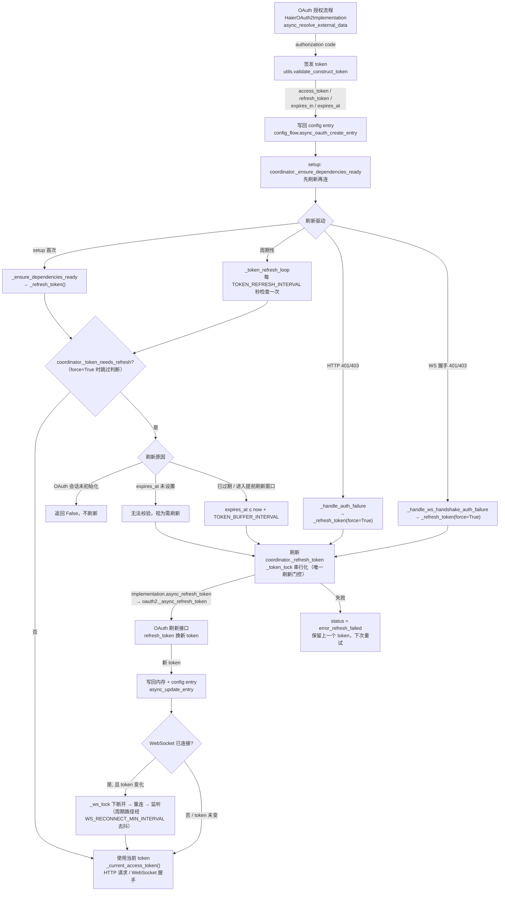

# Token 生命周期

本文档描述 Haier Home 集成中访问令牌（access token）从签发、使用到刷新的完整生命周期状态机，及各阶段用于观测现状的日志记录点。对应的实现位于 `custom_components/haier_home/haier/`。

> **安全说明**：本文档只描述机制、字段名与日志点，**不包含任何真实的 token 值**。代码中 token 从不完整打印——仅进入日志时以脱敏前缀形式出现（见 [`mask_token`](#日志观测点)）。

## 生命周期流程图

## 状态流转说明

| 状态 | 触发路径 | 当前实现 |
| --- | --- | --- |
| **签发 Issued** | OAuth 授权回调 | `oauth2.py:async_resolve_external_data` → `utils.py:validate_construct_token` |
| **写回 Persisted** | 授权流程结束 | `config_flow.py:async_oauth_create_entry` 将 token 存入 `config_entry.data["token"]` |
| **使用 In use** | 每次云请求 / WebSocket 握手 | `coordinator.py:_current_access_token`（只读，不触发刷新） |
| **需刷新 Needs refresh** | 由 setup、周期循环或 401/403 驱动检查 `expires_at` | `coordinator.py:_token_needs_refresh`；驱动方：`_ensure_dependencies_ready`、`_token_refresh_loop`、`_handle_auth_failure`、`_handle_ws_handshake_auth_failure` |
| **刷新 Refreshing** | 提前刷新窗口内或被服务端拒绝 | `coordinator.py:_refresh_token`（`_token_lock` 下串行；`force=True` 时跳过窗口判断） |
| **写回 / 重建** | 刷新成功后 | `async_update_entry` 写回；WS 已连且 token 变化则在 `_ws_lock` 下重建（周期路径经 `WS_RECONNECT_MIN_INTERVAL` 去抖） |
| **失效 Failed** | 刷新失败 | `status = error_refresh_failed`，保留上一 token 待下次重试 |
| **认证失败 Auth failed** | force 刷新后仍失败 | `status = error_auth_failed`，需重新认证（reauth） |
| **无会话 No session** | OAuth 会话未构建（缺 `ag_client_id`） | `status = error_no_oauth_session` |
| **移除 Removed** | 配置条目删除 | `__init__.py:async_remove_entry` → `http_client.logout()` 使服务端 token 失效 |

## 刷新触发说明

`_token_needs_refresh()` 只在以下情形返回“需刷新”：

- `expires_at` 未设置（无法校验新鲜度，保守视为需刷新）；
- `expires_at ≤ now + TOKEN_BUFFER_INTERVAL`（已过期或进入提前刷新窗口）。

当 `OAuth2Session` 尚未初始化时，`_token_needs_refresh()` 返回 `False`（不刷新）。此外，服务端主动拒绝（HTTP 401/403 或 WebSocket 握手被拒）会走 `_refresh_token(force=True)`，**跳过**上述窗口判断直接刷新，因为本地 `expires_at` 已不可信。

相关常量（`const.py`）：`TOKEN_REFRESH_INTERVAL = 3600`（周期检查间隔），`TOKEN_BUFFER_INTERVAL = 86400`（提前刷新窗口），`WS_RECONNECT_MIN_INTERVAL = 30`（两次 token 驱动重连的最小间隔）。

## 日志观测点

token 一律经 `haier/utils.py:mask_token` 脱敏，仅显示前 4 位 + `***`，用于识别 token 是否更新。

| 阶段 | 日志（级别） | 位置 |
| --- | --- | --- |
| 签发 | `OAuth token issued: <masked> (region=...)`（debug） | `oauth2.py:async_resolve_external_data` |
| 准备（签发/刷新共用） | `OAuth token prepared: <masked> (expires_in=...s)`（debug） | `utils.py:validate_construct_token` |
| 刷新（refresh-token 换取） | `OAuth token refreshed via refresh_token: <masked> (region=...)`（debug） | `oauth2.py:_async_refresh_token` |
| 刷新（门控结果 + TTL） | `OAuth token refreshed: <masked> (new TTL: ~...s)`（debug） | `coordinator.py:_refresh_token` |
| 刷新原因 | `Token within refresh window, needs refresh` / `Token expires_at unset; treating as needing refresh` / `Token is still valid` / `OAuth session not initialised; skipping refresh check`（debug） | `coordinator.py:_token_needs_refresh` |
| 刷新失败 | `Failed to refresh token.`（error，含异常栈） | `coordinator.py:_refresh_token` |
| 认证被拒 | `Auth rejected (%s %s -> HTTP %s); refreshing token and retrying`（warning） | `http_client.py:_make_request` |
| WS 重连 | `Reconnecting WebSocket with updated token (token=<masked>)`（debug）/ `WebSocket reconnected successfully with new token`（info） | `coordinator.py:_reconnect_ws` |

## 验证方式

- **流程图语法**：将上方 mermaid 代码块粘贴到支持 mermaid 的渲染器（GitHub、VS Code Markdown 预览、[mermaid.live](https://mermaid.live)）即可渲染并校验语法。
- **token 无泄漏**：本文件仅引用字段名（如 `access_token`）与机制，不含任何实际 token 值或示例值；全库与日志中 token 均经脱敏前缀打印。
