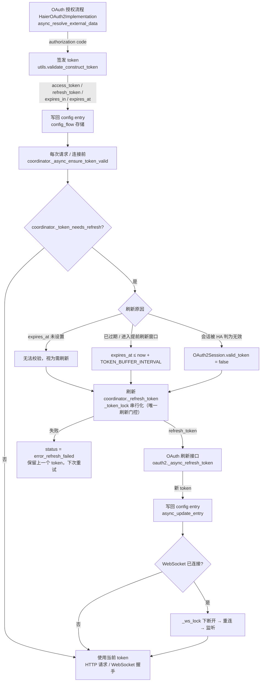

# Token 生命周期

本文档描述 Haier Home 集成中访问令牌（access token）从签发、使用到刷新的完整生命周期状态机，及各阶段用于观测现状的日志记录点（均为 debug 级别）。对应的实现位于 `custom_components/haier_home/haier/`。

> **安全说明**：本文档只描述机制、字段名与日志点，**不包含任何真实的 token 值**。代码中 token 从不完整打印——仅进入 debug 日志时以脱敏前缀形式出现（见 [`mask_token`](#日志观测点)）。

## 生命周期流程图

## 状态流转说明

| 状态 | 触发路径 | 当前实现 |
| --- | --- | --- |
| **签发 Issued** | OAuth 授权回调 | `oauth2.py:async_resolve_external_data` → `utils.py:validate_construct_token` |
| **使用 In use** | 每次云请求 / WebSocket 握手 | `coordinator.py:_async_ensure_token_valid` 与 `_current_access_token` |
| **需刷新 Needs refresh** | 校验 `expires_at` 与会话有效性 | `coordinator.py:_token_needs_refresh` |
| **刷新 Refreshing** | 提前刷新窗口内任意触发 | `coordinator.py:_refresh_token`（`_token_lock` 下串行） |
| **写回 / 重建** | 刷新成功后 | `async_update_entry`；WS 已连则 `_ws_lock` 下重建 |
| **失效 Failed** | 刷新失败 | `status = error_refresh_failed`，保留上一 token |
| **移除 Removed** | 配置条目删除 | 调用 logout 使服务端 token 失效 |

## 日志观测点

全部为 `debug` 级别；token 一律经 `haier/utils.py:mask_token` 脱敏，仅显示前 4 位 + `***`，用于识别 token 是否更新。

| 阶段 | 日志 | 位置 |
| --- | --- | --- |
| 签发 | `OAuth token issued: <masked> (region=...)` | `oauth2.py:async_resolve_external_data` |
| 准备（签发/刷新共用） | `OAuth token prepared: <masked> (expires_in=...s)` | `utils.py:validate_construct_token` |
| 刷新（refresh-token 换取） | `OAuth token refreshed via refresh_token: <masked>` | `oauth2.py:_async_refresh_token` |
| 刷新（门控结果 + TTL） | `OAuth token refreshed: <masked> (new TTL: ~...s)` | `coordinator.py:_refresh_token` |
| 刷新原因 | `Token within refresh window, needs refresh` / `Token expires_at unset...` / `valid_token is False...` | `coordinator.py:_token_needs_refresh` |
| 刷新失败 | `Failed to refresh token.`（error 级，异常栈） | `coordinator.py:_refresh_token` |

## 验证方式

- **流程图语法**：将上方 mermaid 代码块粘贴到支持 mermaid 的渲染器（GitHub、VS Code Markdown 预览、[mermaid.live](https://mermaid.live)）即可渲染并校验语法。
- **token 无泄漏**：本文件仅引用字段名（如 `access_token`）与机制，不含任何实际 token 值或示例值；全库与日志中 token 均经脱敏前缀打印。
